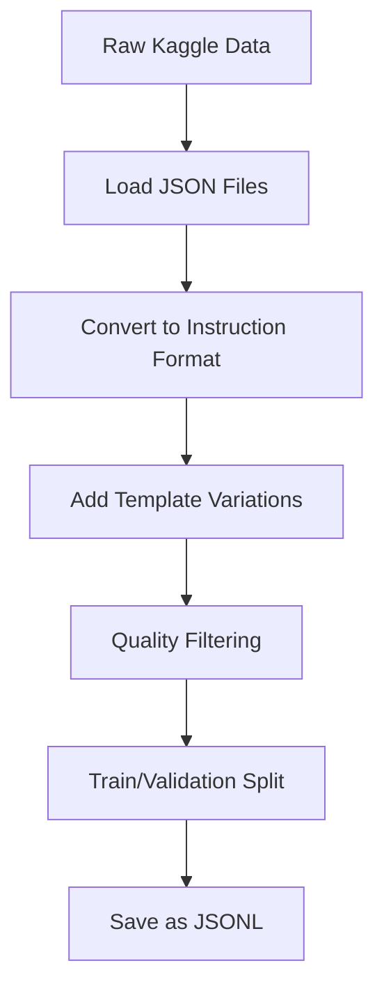

# Legal Law Firm Agent - Training Pipeline Comprehensive Explanation

## 🎯 Overview

This document provides a complete explanation of the Legal Law Firm Agent training pipeline, covering everything from data preparation to model fine-tuning for Indian legal domain adaptation.

## 📋 Table of Contents

1. [Project Architecture](#project-architecture)
2. [Data Pipeline](#data-pipeline)
3. [Training Methodology](#training-methodology)
4. [Step-by-Step Process](#step-by-step-process)
5. [Technical Implementation](#technical-implementation)
6. [Configuration & Customization](#configuration--customization)
7. [Troubleshooting](#troubleshooting)

## 🏗️ Project Architecture

### Directory Structure
```
apps/training/
├── data/                           # All dataset files
│   ├── legal_qa/                   # Raw Kaggle datasets
│   │   ├── constitution_qa.json    # Indian Constitution Q&A
│   │   ├── ipc_qa.json            # Indian Penal Code Q&A
│   │   └── crpc_qa.json           # Criminal Procedure Code Q&A
│   └── processed/                  # Processed training data
│       ├── train.jsonl             # Training split (13,178 samples)
│       ├── validation.jsonl        # Validation split (1,465 samples)
│       └── combined_legal_instructions.jsonl
├── models/                         # Output directory for trained models
├── preprocess_legal_data.py        # Data preprocessing script
├── train_legal_model.py           # Main training script
├── setup_training.py              # Environment verification
├── quick_train_test.py            # Quick testing pipeline
├── requirements_training.txt       # Python dependencies
├── TRAINING_README.md             # Quick reference guide
└── Explanation.md                 # This comprehensive guide
```

### Core Components

**1. Data Processing Pipeline**
- Raw dataset loading and validation
- Instruction format conversion
- Train/validation splitting
- Quality control and filtering

**2. Training Infrastructure**
- LoRA (Low-Rank Adaptation) fine-tuning
- Mixed precision training
- Gradient checkpointing for memory efficiency
- Configurable model architectures

**3. Evaluation & Testing**
- Automated pipeline testing
- Model validation
- Performance monitoring

## 📊 Data Pipeline

### 1. Data Sources

We use the **akshatgupta7/llm-fine-tuning-dataset-of-indian-legal-texts** from Kaggle, which contains:

| Dataset | Samples | Content | Purpose |
|---------|---------|---------|---------|
| Constitution QA | 4,082 | Indian Constitution articles, rights, duties | Constitutional law understanding |
| IPC QA | 2,267 | Indian Penal Code sections, offenses, punishments | Criminal law knowledge |
| CrPC QA | 8,194 | Criminal procedure, court processes, legal procedures | Procedural law expertise |

**Total: 14,643 instruction-formatted samples**

### 2. Data Processing Workflow



#### Raw Data Format (Input)
```json
{
    "question": "What is Article 21 of the Indian Constitution?",
    "answer": "Article 21 guarantees the right to life and personal liberty..."
}
```

#### Instruction Format (Output)
```json
{
    "instruction": "Answer the following question about the Indian Constitution:",
    "input": "What is Article 21 of the Indian Constitution?",
    "output": "Article 21 guarantees the right to life and personal liberty..."
}
```

### 3. Data Quality Controls

- **Validation**: All samples must have non-empty question and answer fields
- **Deduplication**: Remove duplicate questions across datasets
- **Length filtering**: Remove overly short or long samples
- **Template diversity**: Multiple instruction templates per domain

## 🧠 Training Methodology

### 1. Why LoRA (Low-Rank Adaptation)?

LoRA is chosen for several key reasons:

**Memory Efficiency**: Instead of fine-tuning all 8B parameters of Qwen3, LoRA only trains a small subset (~1% of parameters), reducing memory requirements from ~32GB to ~8GB.

**Training Speed**: Faster convergence and reduced training time.

**Modularity**: LoRA adapters can be easily swapped, combined, or distributed separately from the base model.

**Quality**: Maintains comparable performance to full fine-tuning for domain adaptation tasks.

### 2. LoRA Configuration

```python
LoraConfig(
    r=8,                    # Rank - controls adapter size
    lora_alpha=16,          # Scaling parameter
    target_modules=[        # Which layers to adapt
        "q_proj", "v_proj", 
        "k_proj", "o_proj"
    ],
    lora_dropout=0.1,       # Dropout for regularization
    task_type=TaskType.CAUSAL_LM
)
```

**Parameters Explained:**
- `r=8`: Lower rank = fewer parameters, faster training, but potentially less capacity
- `lora_alpha=16`: Higher values increase the influence of LoRA adapters
- `target_modules`: Focus on attention layers where legal knowledge is most relevant

### 3. Training Strategy

**Phase 1: Instruction Following**
- Learn to follow legal question-answering format
- Understand legal domain terminology
- Maintain general language capabilities

**Phase 2: Domain Knowledge**
- Absorb specific Indian legal knowledge
- Learn connections between different legal concepts
- Develop legal reasoning patterns

**Phase 3: Specialization**
- Fine-tune for specific legal tasks (constitutional law, criminal law, procedures)
- Optimize response quality and accuracy
- Reduce hallucinations in legal context

## 🔧 Step-by-Step Process

### Step 1: Environment Setup

```bash
# Navigate to training directory
cd apps/training

# Install dependencies
pip install -r requirements_training.txt

# Verify setup
python3 setup_training.py
```

**What happens:**
- Installs PyTorch, Transformers, PEFT, and other ML libraries
- Checks for CUDA availability
- Verifies data files exist
- Tests data loading functionality

### Step 2: Data Preprocessing (Already Done)

```bash
# If you need to reprocess data
python3 preprocess_legal_data.py --show_samples
```

**Process details:**
1. **Load raw JSON files** from `data/legal_qa/`
2. **Convert format**: Question-answer pairs → Instruction format
3. **Add variations**: Multiple instruction templates per domain
4. **Split data**: 90% training, 10% validation
5. **Save as JSONL**: One sample per line for efficient loading

### Step 3: Quick Pipeline Test

```bash
# Test with small model first
python3 quick_train_test.py
```

**Why this step is crucial:**
- Validates entire pipeline without long training time
- Catches configuration errors early
- Tests memory usage with your hardware
- Verifies data loading and tokenization

### Step 4: Training Configuration

Choose your training approach based on available hardware:

#### Option A: CPU Training (Testing)
```bash
python3 train_legal_model.py \
  --model_name microsoft/DialoGPT-medium \
  --epochs 2 \
  --max_train_samples 1000 \
  --batch_size 1
```

#### Option B: GPU Training (Recommended)
```bash
python3 train_legal_model.py \
  --model_name Qwen/Qwen2.5-7B-Instruct \
  --epochs 3 \
  --max_train_samples 5000 \
  --batch_size 4 \
  --output_dir models/legal-qwen-lora
```

#### Option C: Full Training
```bash
python3 train_legal_model.py \
  --model_name Qwen/Qwen2.5-7B-Instruct \
  --epochs 5 \
  --batch_size 2 \
  --use_wandb \
  --output_dir models/legal-qwen-full
```

### Step 5: Training Process

**What happens during training:**

1. **Model Loading**: Downloads and loads base model (Qwen/DialoGPT)
2. **Tokenizer Setup**: Configures tokenization for instruction format
3. **LoRA Initialization**: Adds trainable adapter layers
4. **Data Loading**: Loads and tokenizes training/validation data
5. **Training Loop**: 
   - Forward pass through model
   - Calculate loss on legal Q&A task
   - Backward pass (only LoRA parameters updated)
   - Validation evaluation every N steps
6. **Model Saving**: Saves LoRA weights and tokenizer

**Training Logs Example:**
```
Epoch 1/3:
  Step 100: loss=2.34, learning_rate=1.8e-4
  Step 200: loss=1.89, learning_rate=1.6e-4
  Validation: loss=1.95, perplexity=7.02
Epoch 2/3:
  Step 300: loss=1.67, learning_rate=1.4e-4
  ...
```

### Step 6: Model Testing

After training, test your model:

```python
# Load trained model
from transformers import AutoTokenizer, AutoModelForCausalLM
from peft import PeftModel

tokenizer = AutoTokenizer.from_pretrained("Qwen/Qwen2.5-7B-Instruct")
base_model = AutoModelForCausalLM.from_pretrained("Qwen/Qwen2.5-7B-Instruct")
model = PeftModel.from_pretrained(base_model, "models/legal-qwen-lora")

# Test legal question
prompt = """### Instruction:
Answer the following question about Indian law:

### Input:
What are the fundamental rights guaranteed by the Indian Constitution?

### Response:
"""

inputs = tokenizer(prompt, return_tensors="pt")
outputs = model.generate(**inputs, max_length=300, temperature=0.7)
response = tokenizer.decode(outputs[0], skip_special_tokens=True)
print(response)
```

## ⚙️ Technical Implementation

### 1. Model Architecture Adaptations

**Base Model: Qwen2.5-7B-Instruct**
- Pre-trained on diverse text including some legal content
- Instruction-following capabilities
- Strong reasoning and comprehension
- Multilingual support (important for Indian legal context)

**LoRA Modifications:**
- Adapter layers in attention mechanisms
- Preserved base model knowledge
- Focused learning on legal domain patterns

### 2. Training Optimizations

**Memory Efficiency:**
- **Gradient Checkpointing**: Saves memory by recomputing gradients
- **Mixed Precision (FP16)**: Reduces memory usage and speeds training
- **Parameter Freezing**: Only LoRA parameters are trainable

**Training Stability:**
- **Warmup Schedule**: Gradual learning rate increase
- **Weight Decay**: Prevents overfitting
- **Gradient Clipping**: Prevents gradient explosions

**Performance:**
- **DataLoader Optimizations**: Efficient batch loading
- **Multi-GPU Support**: When available
- **Cached Tokenization**: Faster data processing

### 3. Evaluation Metrics

**During Training:**
- **Perplexity**: Measures how well model predicts next tokens
- **Loss Curves**: Training vs validation loss tracking
- **Learning Rate**: Adaptive scheduling

**Post-Training Evaluation:**
- **Legal Question Accuracy**: Manual evaluation on held-out questions
- **Hallucination Detection**: Checking for false legal claims
- **Response Quality**: Coherence, relevance, completeness

## 🎛️ Configuration & Customization

### 1. Model Selection

**For CPU/Limited Resources:**
```python
--model_name microsoft/DialoGPT-medium
--model_name distilbert-base-uncased
--model_name prajjwal1/bert-tiny
```

**For GPU Training:**
```python
--model_name Qwen/Qwen2.5-7B-Instruct
--model_name microsoft/phi-2
--model_name google/flan-t5-large
```

**For High-End Hardware:**
```python
--model_name Qwen/Qwen2.5-14B-Instruct
--model_name meta-llama/Llama-2-13b-chat-hf
```

### 2. LoRA Hyperparameters

**Conservative (Stable but slower):**
```python
--lora_rank 4
--lora_alpha 8
--learning_rate 1e-4
```

**Balanced (Recommended):**
```python
--lora_rank 8
--lora_alpha 16
--learning_rate 2e-4
```

**Aggressive (Faster but riskier):**
```python
--lora_rank 16
--lora_alpha 32
--learning_rate 5e-4
```

### 3. Training Duration

**Quick Test (1-2 hours):**
```python
--epochs 1
--max_train_samples 1000
--batch_size 2
```

**Development (4-6 hours):**
```python
--epochs 3
--max_train_samples 5000
--batch_size 4
```

**Production (8-12 hours):**
```python
--epochs 5
--batch_size 8
# Use all training data
```

### 4. Custom Data Integration

To add your own legal datasets:

1. **Format your data:**
```json
{
    "question": "Your legal question",
    "answer": "Your legal answer"
}
```

2. **Add to preprocessing script:**
```python
# In preprocess_legal_data.py
custom_files = ["custom_legal_qa.json"]
for custom_file in custom_files:
    # Process your custom data
```

3. **Update instruction templates:**
```python
elif "custom" in source_name.lower():
    instruction_template = "Answer the following question about [Your Domain]:"
```

## 🚨 Troubleshooting

### Common Issues & Solutions

#### 1. Memory Errors

**Error:** `CUDA out of memory`
**Solutions:**
- Reduce batch size: `--batch_size 1`
- Reduce sequence length: `--max_length 512`
- Use smaller model: `--model_name distilbert-base-uncased`
- Enable gradient checkpointing (already enabled)

#### 2. Training Slow/Stuck

**Error:** Training speed < 1 step/second
**Solutions:**
- Check GPU utilization: `nvidia-smi`
- Increase batch size if memory allows
- Use mixed precision (already enabled)
- Check CPU/RAM bottlenecks

#### 3. Model Loading Errors

**Error:** `Model not found` or `Connection error`
**Solutions:**
- Check internet connection for HuggingFace downloads
- Verify model name spelling
- Use local model cache
- Try different model variants

#### 4. Data Loading Issues

**Error:** `FileNotFoundError` or `JSON decode error`
**Solutions:**
- Verify data files exist: `ls data/processed/`
- Check file permissions
- Re-run preprocessing: `python3 preprocess_legal_data.py`
- Validate JSON format

#### 5. Poor Training Results

**Symptoms:** High loss, poor legal answers
**Solutions:**
- Increase training epochs: `--epochs 5`
- Use more training data: remove `--max_train_samples`
- Adjust learning rate: `--learning_rate 1e-4`
- Check data quality and preprocessing

### Hardware Requirements

**Minimum (CPU Only):**
- 16GB RAM
- 50GB storage
- Small models only (DialoGPT-medium)

**Recommended (GPU):**
- 16GB+ GPU VRAM (RTX 4090, A100)
- 32GB+ system RAM
- 100GB+ storage
- Qwen 7B models

**Optimal (Multi-GPU):**
- Multiple high-end GPUs
- 64GB+ system RAM
- NVMe SSD storage
- Qwen 14B+ models

### Performance Monitoring

**With Weights & Biases:**
```bash
python3 train_legal_model.py --use_wandb
```

**Manual Monitoring:**
- Watch GPU utilization: `watch -n 1 nvidia-smi`
- Monitor training logs for loss curves
- Check validation performance every 500 steps
- Track memory usage patterns

## 📈 Advanced Topics

### 1. Multi-Domain Training

Combine multiple legal domains:
```python
# Add more specialized datasets
corporate_law_data = load_corporate_law_qa()
family_law_data = load_family_law_qa()
# Combine with existing criminal/constitutional law
```

### 2. Continual Learning

Update model with new legal developments:
```python
# Load existing LoRA weights
# Add new legal cases/amendments
# Continue training from checkpoint
```

### 3. Model Ensemble

Combine multiple specialized models:
```python
constitutional_model = load_constitutional_expert()
criminal_model = load_criminal_expert()
# Route questions to appropriate expert
```

### 4. Custom Evaluation

Implement domain-specific metrics:
```python
def legal_accuracy_score(predictions, references):
    # Check legal citation accuracy
    # Verify statutory references
    # Measure legal reasoning quality
```

## 🚀 Production Deployment

### 1. Model Export

```python
# Export for production
model.save_pretrained("production_model/")
tokenizer.save_pretrained("production_model/")
```

### 2. Inference Optimization

```python
# Optimize for serving
from torch.jit import script
scripted_model = script(model)
```

### 3. API Integration

```python
# FastAPI endpoint
@app.post("/legal_query")
def answer_legal_question(question: str):
    response = model.generate(question)
    return {"answer": response}
```

## 📚 Further Learning

### Research Papers
- **LoRA**: "Low-Rank Adaptation of Large Language Models"
- **Instruction Tuning**: "Training language models to follow instructions"
- **Legal AI**: "Legal Question Answering with Large Language Models"

### Documentation
- [HuggingFace Transformers](https://huggingface.co/docs/transformers)
- [PEFT Library](https://huggingface.co/docs/peft)
- [PyTorch Training](https://pytorch.org/tutorials/beginner/basics/quickstart_tutorial.html)

### Datasets
- [LegalBench](https://github.com/HazyResearch/legalbench)
- [Indian Legal Documents](https://github.com/Legal-NLP-EkStep/legal_NER)
- [Multi-Legal-Pile](https://huggingface.co/datasets/multilegal/MultiLegalPile)

---

## 🎉 Conclusion

This comprehensive training pipeline provides everything needed to fine-tune a legal domain LLM for Indian law. The combination of high-quality legal datasets, efficient LoRA training, and robust infrastructure makes it possible to create a specialized legal assistant with modest computational resources.

**Key Success Factors:**
1. **Quality Data**: Curated Indian legal Q&A from authoritative sources
2. **Efficient Training**: LoRA enables training on consumer hardware  
3. **Proper Evaluation**: Testing ensures model quality and reliability
4. **Production Ready**: Clear deployment path for real applications

Start with the quick test, then scale up based on your needs and hardware. The modular design allows for easy customization and extension to additional legal domains.

**Happy training! 🏛️⚖️🤖**